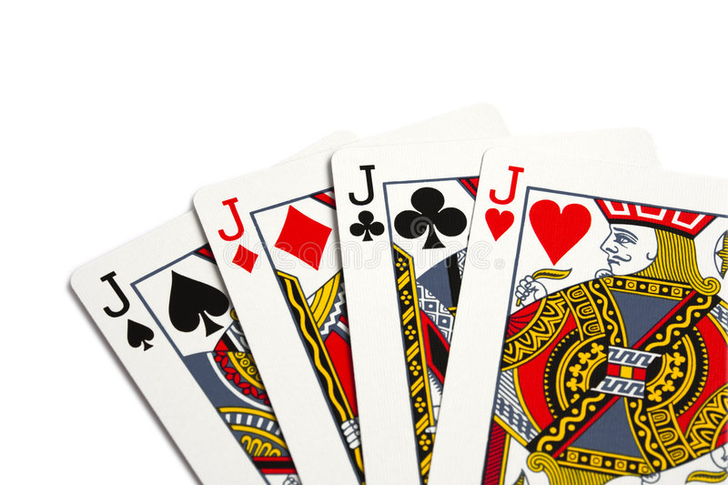

# Golden-Hook-Fishing

A simple Java implementation of Golden Hook Fishing, a simple localized Chinese poker game, where the user plays against a single AI component under a simple ruleset. 

Golden Hook Fishing is a popular casual card game played in particular regions in China, dating back to as far as the 60s.  

Despite the game's popularity in my hometown of northeastern China where I was born, I have few trace of implementation of the game, even fewer with a proper on the internet as a whole, and found no trace of the game whatsoever in the English side of the internet. This could be that the game was not as popular as I expected, or that the game is too simple in nature to spark anyone's interest to implement. It is also possible that the game was derived from another card game in the world with a different name, and that i'm looking 've been looking into the wrong place  

Nevertheless, this implementation serves as a nostaligic callback to my childhood memories, an opportunity to practice with the Swing GUI and coding in general, as well as an attempt to expose this game's presence to anyone who come across this repository.** If you happens to know another card game with similar ruleset to Golden Hook Fishing in your native country, do please let me know, I'd love to learn more about the game's origin and any derived version of it!**

 
 

Game Description:

Golden Hook Fishing, also known as Golden Hook, Pull the Train, Stack the Tower, and possible many other localized chinese name, is a poker game commonly played in certain region of Mainland China, particularly northeastern China as far as I know. The game involves 2 or more people, and is played semi-automatically by following the rule of the game, with no decision making process required on any player's side and the outcome entirely dependent on each player's luck, making it a great casual card game for fun. 

 
 

Rule of the Game:

The game uses one or more standard chinese 54-card poker deck, which consist of standard 52-card deck and two joker, one red/colored and one grey/colorless. Usually n/2 (round up) decks of these 54-card deck is used for a n-player game to ensure varity and length of each game, though more decks of card can be used. The order of play is decided before play and does not change, usually in either clockwise or counter clockwise.

At the start of a game, all deck used are to be shuffled and all cards are to be distributed evenly to each player, the amount of 54-card deck used should perferable be a number that will guarantee equal distribution of cards for each player. The cards distributed to each player will be organized into a draw deck for that player with all card facing down. A player is randomly chosen to be the first to play, then each player takes turns afterwards.

In each player's turn, the player will draw a card from top of their draw deck and play them into the center board area. The cards in the board area should be organized in a verticle stacking fashion similar to solitaire, but with all cards facing up and each card's rank visible to all player. Newly played cards are to be added to the bottom of the stack. If nothing special happens after the play, the turn ends and the next player gets to play.

The game consist of three types of special cards: the color Joker, colorless Joker, and the four Jack. When either variance of Joker are played, all player on board has to tribute cards from top of their draw deck to the playing player, with each player contributing 5 cards for color Joker and 3 cards for colorless Joker. The Jack, with it's rank being the letter J, a figure resembling a fishing hook, is the "Golden Hook" of the game, hence the name. When a Jack is played onto the board with some cards already on board, it, as the Golden Hook, fishes out all cards on board, including itself, and add those card to the bottom of the playing player's draw deck. However, when Jack is played into a empty board, it it said to "sink into the pond" and will not be retrieved back to the playing player's hand. Such a Jack can only be collected by another player playing a Jack of their own after the scenario, which fishes out all card the entire board, including any potentially sunken Jack played on board.

Other than the special cards, there is another way to obtain cards by fishing them out of the board. All cards ranging from 2 to 10, Ace, Queen and King are considered common cards. They do nothing when played onto a board, but when a common card is played into the board with a rank that is already present on the board, the player gets to fish out all cards inbetween the two duplicate-rank cards, including the two duplicate-rank cards themselves. You can have two duplicate rank card played back to back and it'd still count as a valid fishing event where the two cards are collected, or a long chain of cards fished with a duplicate rank card played with the first duplicate locating on top of a long stack of cards on board.

All card aquisition are to be added to the bottom of the draw deck with no shuffling needed, and all card draw are drawn from the top of the draw deck. Whenever a player obtains a card in their turn, either through Jack, Joker or rank-duplicate normal cards, they have to play again in their turn after collecting their cards before moving onto the next player in order. This is a balancing act to give the losing player a chance by making the winning player play first on an empty board, where there's a possibility that the player plays a Jack onto an empty board and sinks it, which the other player can obtain for themselves by playing their own Jack.

The goal of the game for each player is to deprive your opponents of all of their cards and transfer those cards into your own draw deck. A player is out of the game when they ran out of their draw deck, with a win called when only one player remains, in which they will be taksed with shuffling and distributing the cards in the next round for punishment of their victory. 

The game is purely luck-based and can easily snowball into one player's victory, but comeback is still possible with losing player reaping a large board and special cards like Jack and the Jokers being able to transfer between players.
